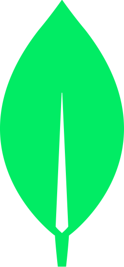

# Hi there 👋

I'm Jonathan Kimball, a software engineer passionate about learning and building
things. I am engaged in multiple projects. As time allows, I will make more of
them available on GitHub.

<!-- I'm also looking for a job. If you're interested in hiring me, 
please reach out to me at -->

  

  <!--  -->

---

<!-- Dark/Light test  -->

<!-- #gh-light-mode-only and #gh-dark-mode-only are depreciated. 
Updated to use <picture> element instead.
(see: https://docs.github.com/en/get-started/writing-on-github/getting-started-with-writing-and-formatting-on-github/basic-writing-and-formatting-syntax#specifying-the-theme-an-image-is-shown-to) -->

<picture>
  <source media="(prefers-color-scheme: dark)" srcset="https://github-readme-stats.vercel.app/api/top-langs/?username=JAKimball&layout=compact&langs_count=8&theme=dark">
  <source media="(prefers-color-scheme: light)" srcset="https://github-readme-stats.vercel.app/api/top-langs/?username=JAKimball&layout=compact&langs_count=8&theme=light">
  
</picture>

  JavaScript | TypeScript | React | Node.js | MongoDB | PostgreSQL | TailwindCSS

  <!-- TODO: Make links open on separate tabs -->

  
  
  
  
  
  
  

<!-- Linkedin badges -->
<!-- Commented out unless we can find a way to get the JS to run. 
Probably not possible in GitHub markdown for security reasons, 
but we can use it elsewhere. -->

<iframe>
  

    <a class="badge-base__link LI-simple-link" href="https://www.linkedin.com/in/jonathan-kimball?trk=profile-badge">
      Jonathan Kimball
    </a>
  

  

    <a class="badge-base__link LI-simple-link" href="https://www.linkedin.com/in/jonathan-kimball?trk=profile-badge">
      Jonathan Kimball
    </a>
  

  
  <!--  -->
</iframe>

<!-- 

 -->

<!--
**JAKimball/JAKimball** is a ✨ _special_ ✨ repository because its `README.md` 
(this file) appears on your GitHub profile.

Here are some ideas to get you started:

- 🔭 I’m currently working on ...
- 🌱 I’m currently learning ...
- 👯 I’m looking to collaborate on ...
- 🤔 I’m looking for help with ...
- 💬 Ask me about ...
- 📫 How to reach me: ...
- 😄 Pronouns: ...
- ⚡ Fun fact: ...
-->
